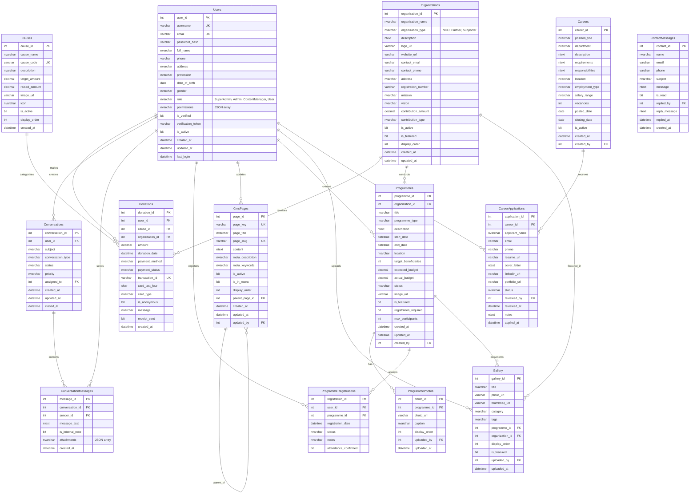

# Database Schema V2: Give-AID NGO Website (REFACTORED)

## 📊 Tổng quan thay đổi

### ✅ Đã áp dụng các đề xuất:

| Thay đổi | Trước | Sau | Lý do |
|----------|-------|-----|-------|
| **1. Gộp Users & Admins** | 2 bảng riêng | 1 bảng `Users` với field `role` | RBAC chuẩn, dễ quản lý permissions |
| **2. Gộp NGOs, Partners, Supporters** | 3 bảng riêng | 1 bảng `Organizations` với `organization_type` | Tránh duplicate, dễ mở rộng |
| **3. Đổi tên Queries** | `Queries` + `QueryReplies` | `Conversations` + `ConversationMessages` | Tên chuẩn hơn, mở rộng được |
| **4. Bỏ Invitations** | Có bảng `Invitations` | ❌ Removed | Đơn giản hóa schema |
| **5. Tách AboutUsPages** | `AboutUsPages` | `CmsPages` (tách riêng `Programmes`) | Phân biệt nội dung tĩnh vs sự kiện |

---

## 🗄️ Database Schema V2 (14 bảng)



---

## 📋 Chi tiết 14 bảng

### **1. Users** (Đã gộp Admins + Users)
**Mục đích:** Quản lý tất cả người dùng với phân quyền role

| Field | Type | Mô tả |
|-------|------|-------|
| `role` | NVARCHAR(20) | 'SuperAdmin', 'Admin', 'ContentManager', 'User' |
| `permissions` | NVARCHAR(MAX) | JSON array cho permissions chi tiết |
| `profession` | NVARCHAR(100) | Nghề nghiệp (cho user thường) |
| `date_of_birth` | DATE | Ngày sinh |
| `is_verified` | BIT | Email đã xác thực |

**Enum values:**
- `role`: SuperAdmin, Admin, ContentManager, User

---

### **2. Organizations** (Đã gộp NGOs + Partners + Supporters)
**Mục đích:** Quản lý tất cả tổ chức liên quan

| Field | Type | Mô tả |
|-------|------|-------|
| `organization_type` | NVARCHAR(20) | 'NGO', 'Partner', 'Supporter' |
| `registration_number` | VARCHAR(50) | Mã đăng ký (cho NGO) |
| `mission`, `vision` | NVARCHAR(500) | Sứ mệnh, tầm nhìn (cho NGO) |
| `contribution_amount` | DECIMAL(18,2) | Số tiền đóng góp (cho Partner/Supporter) |
| `contribution_type` | NVARCHAR(50) | 'Financial', 'InKind', 'Volunteer' |

**Enum values:**
- `organization_type`: NGO, Partner, Supporter
- `contribution_type`: Financial, InKind, Volunteer

---

### **3. Causes** (Không đổi)
**Mục đích:** Danh mục các nguyên nhân quyên góp

---

### **4. Donations** (Cải tiến)
**Mục đích:** Lưu trữ thông tin quyên góp

| Cải tiến | Mô tả |
|----------|-------|
| `receipt_sent` | Đánh dấu đã gửi biên nhận |
| `organization_id` | FK tới `Organizations` (thay vì `NGOs`) |

**Enum values:**
- `payment_method`: CreditCard, DebitCard, NetBanking, UPI
- `payment_status`: Pending, Completed, Failed, Refunded

---

### **5. CmsPages** (Mới - thay thế AboutUsPages)
**Mục đích:** Quản lý nội dung tĩnh (static pages)

| Field | Type | Mô tả |
|-------|------|-------|
| `page_key` | VARCHAR(50) | Key duy nhất (home, about_us...) |
| `page_slug` | VARCHAR(100) | URL slug |
| `meta_description` | NVARCHAR(255) | SEO description |
| `meta_keywords` | NVARCHAR(255) | SEO keywords |
| `is_in_menu` | BIT | Hiển thị trong menu |
| `parent_page_id` | INT FK | Cho cấu trúc cây (sub-pages) |

**Seed data:** home, about_us, what_we_do, our_mission, our_team, careers, achievements, contact_us

---

### **6. Programmes** (Cải tiến - tách riêng khỏi CmsPages)
**Mục đích:** Quản lý sự kiện, chương trình

| Cải tiến | Mô tả |
|----------|-------|
| `organization_id` | FK tới `Organizations` |
| `actual_budget` | Ngân sách thực tế |
| `registration_required` | Có cần đăng ký không |
| `max_participants` | Số người tối đa |
| `created_by` | FK tới `Users` |

**Enum values:**
- `programme_type`: Education, HealthCare, ChildWelfare, WomenEmpowerment
- `status`: Upcoming, Ongoing, Completed, Cancelled

---

### **7. ProgrammePhotos** (Không đổi)
**Mục đích:** Hình ảnh của chương trình

---

### **8. ProgrammeRegistrations** (Cải tiến)
**Mục đích:** Đăng ký tham gia chương trình

| Cải tiến | Mô tả |
|----------|-------|
| `attendance_confirmed` | Đã xác nhận tham dự |
| UNIQUE constraint | (user_id, programme_id) - không đăng ký trùng |

---

### **9. Conversations** (Đã đổi tên từ Queries)
**Mục đích:** Quản lý cuộc hội thoại/hỗ trợ

| Field | Type | Mô tả |
|-------|------|-------|
| `conversation_type` | NVARCHAR(50) | 'Support', 'Donation', 'Programme', 'Partnership', 'General' |
| `assigned_to` | INT FK | Admin được giao việc |
| `closed_at` | DATETIME | Thời gian đóng |

**Enum values:**
- `conversation_type`: Support, Donation, Programme, Partnership, General
- `status`: Open, InProgress, Resolved, Closed
- `priority`: Low, Normal, High, Urgent

---

### **10. ConversationMessages** (Đã đổi tên từ QueryReplies)
**Mục đích:** Tin nhắn trong cuộc hội thoại

| Field | Type | Mô tả |
|-------|------|-------|
| `sender_id` | INT FK | Người gửi (User hoặc Admin) |
| `is_internal_note` | BIT | Ghi chú nội bộ (chỉ admin thấy) |
| `attachments` | NVARCHAR(MAX) | JSON array file đính kèm |

---

### **11. Careers** (Cải tiến)
**Mục đích:** Tin tuyển dụng

| Cải tiến | Mô tả |
|----------|-------|
| `responsibilities` | Chi tiết trách nhiệm |
| `vacancies` | Số vị trí tuyển |
| `created_by` | FK tới Users |

**Enum values:**
- `employment_type`: FullTime, PartTime, Contract, Volunteer, Internship

---

### **12. CareerApplications** (Cải tiến)
**Mục đích:** Đơn ứng tuyển

| Cải tiến | Mô tả |
|----------|-------|
| `linkedin_url`, `portfolio_url` | Thêm links |
| `reviewed_by` | Admin xem xét |
| `notes` | Ghi chú review |

**Enum values:**
- `status`: Submitted, Screening, Interview, Offered, Accepted, Rejected

---

### **13. Gallery** (Cải tiến)
**Mục đích:** Thư viện hình ảnh

| Cải tiến | Mô tả |
|----------|-------|
| `thumbnail_url` | URL ảnh thumbnail |
| `tags` | Tags phân loại |
| `organization_id` | FK tới Organizations |

---

### **14. ContactMessages** (Mới - tách từ ContactUs)
**Mục đích:** Form liên hệ

---

## 🔍 Views đã tạo

| View | Mục đích |
|------|----------|
| `vw_ActiveNGOs` | Chỉ lấy NGOs đang active |
| `vw_ActivePartners` | Chỉ lấy Partners đang active |
| `vw_AdminUsers` | Danh sách Admin users |
| `vw_DonationsByCause` | Thống kê quyên góp theo cause |

---

## 📊 So sánh V1 vs V2

| Metric | V1 | V2 | Thay đổi |
|--------|----|----|----------|
| **Số bảng** | 18 | 14 | -4 bảng (-22%) |
| **Phân quyền** | 2 bảng riêng | 1 bảng RBAC | ✅ Chuẩn hơn |
| **Organizations** | 3 bảng | 1 bảng | ✅ Giảm duplicate |
| **Messaging** | Queries/Replies | Conversations/Messages | ✅ Tên rõ ràng hơn |
| **CMS** | AboutUsPages | CmsPages | ✅ Tách biệt nội dung tĩnh |
| **Invitations** | Có | Bỏ | ✅ Đơn giản hóa |

---

## 🎯 Ưu điểm của V2

### 1. **Đơn giản hơn** (-4 bảng)
- Giảm từ 18 xuống 14 bảng
- Ít foreign keys phức tạp hơn

### 2. **Chuẩn RBAC**
- 1 bảng Users với role thay vì tách Admins/Users
- Dễ mở rộng permissions

### 3. **Polymorphic Organizations**
- NGO, Partner, Supporter cùng 1 bảng
- Dễ thêm type mới (Donor, Volunteer...)

### 4. **Better naming**
- Conversations thay Queries (chuẩn hơn)
- ConversationMessages thay QueryReplies

### 5. **Tách biệt rõ ràng**
- CmsPages = Nội dung tĩnh
- Programmes = Sự kiện động

---

## 🚀 Migration từ V1 → V2

```sql
-- 1. Merge Admins → Users
INSERT INTO Users (username, email, password_hash, full_name, role, ...)
SELECT username, email, password_hash, full_name, 'Admin' as role, ...
FROM Admins;

-- 2. Merge NGOs → Organizations
INSERT INTO Organizations (organization_name, organization_type, ...)
SELECT ngo_name, 'NGO' as organization_type, ...
FROM NGOs;

-- 3. Merge Partners → Organizations
INSERT INTO Organizations (organization_name, organization_type, ...)
SELECT company_name, 'Partner' as organization_type, ...
FROM Partners;

-- 4. Rename Queries → Conversations
-- (Tương tự với các bảng khác)
```

---

## ✅ Kết luận

Schema V2 đã áp dụng **TẤT CẢ các đề xuất hợp lý**:
- ✅ Gộp Users & Admins
- ✅ Gộp NGOs, Partners, Supporters → Organizations
- ✅ Đổi Queries → Conversations
- ✅ Bỏ Invitations
- ✅ Tách CmsPages riêng (KHÔNG gộp với Programmes vì khác bản chất)

**Kết quả:** Schema gọn hơn, chuẩn hơn, dễ maintain hơn! 🎉
